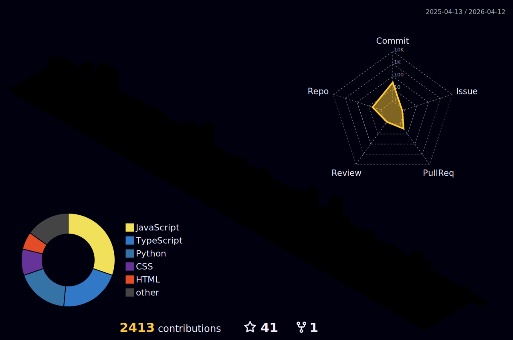

<h3>Undergraduate Student @SLIIT</h3>
<h6>BSc (Hons) in Information Technology
Specialising in Information Technology</h6>

<!-- 
  
 -->

<h4>∙∙ Thank You for taking the time to view my GitHub Profile :dizzy: </h4>

- 🔭 Former Intern software engineer at **Axiata Digital Labs** 

- 🌱 I’m currently learning **Software Engineering @SLIIT** 

- 🤝 I’m looking for help  **for my Projects**..

- 📫 How to reach me **dulthiwanka2015@gmail.com**

<!-- - 🤔 I’m looking for help with **My projects** -->

- ⚡ Fun fact **Sometimes, I talking with myself** :wave: 

<h3 align="left">Connect with me: :comet: </h3>

 

<h3 align="left">Languages and Tools: :comet: </h3>

                     

 

  

 

  

  
 

